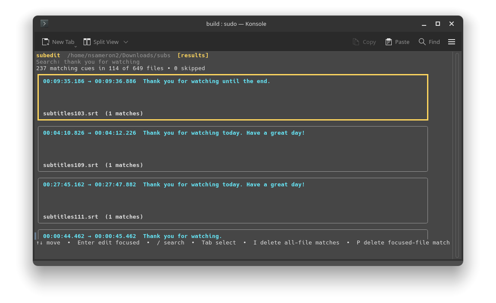

<p align="center">
  
</p>

<h1 align="center">subedit</h1>

A TUI & CLI tool made for curating Whisper generated subtitles. Batch delete specific hallucinated phrases in all of your subtitle files with the press of a button.

<p align="center">
  
</p>

Built in Go with the Charm ecosystem.

## Overview

I've always found OpenAI Whisper, or any other AI subtitle generator frustrating to use due to the amount of garbage that it generates in subtitles, such as "Thank you for watching." So, I made this tool to help bulk clean up subtitles. Just search any garbage phrase, and bach delete them away from the passed in recursively scanned directory.

## Build

Go 1.25 or newer is required.

```sh
make build
./build/subedit
```

The binary is written to `build/subedit`. Pass a directory to start somewhere
other than the current working directory:

```sh
./build/subedit /path/to/subtitles
./build/subedit tui /path/to/subtitles
```

## Interactive workflow

Start typing to search visible subtitle text across the workspace. Matching is
a case-insensitive literal substring search: markup is ignored and whitespace
is normalized, so a phrase can span multiple subtitle rows.

The workspace view supports quick batch cleanup:

| Key | Action |
|---|---|
| `Enter` | Focus results or open the focused file |
| `I` | Delete matching cues from all files |
| `P` | Delete matching cues from the focused file only |
| `Tab` | Enter file-selection mode |
| `Space` | Select or deselect the focused file |
| `A` | Select all matching files |
| `O` | Delete matching cues from selected files |
| `/` | Return to the search field |
| `R` | Rescan the workspace |
| `U` | Undo the latest operation |
| `?` | Show expanded help |
| `Q` | Quit |

Every interactive delete shows the exact cue and file counts before it writes.

### Immersive cue editor

Press `Enter` on a focused file to inspect its cues in source order. If you
opened it from search results, the same phrase becomes the editor's initial
filter; clear the filter to reveal the whole file.

| Key | Action |
|---|---|
| `↑`/`↓`, `j`/`k` | Move between cues |
| `PgUp`/`PgDn`, `Home`/`End` | Navigate through the file |
| `Space` or `D` | Mark the focused cue for deletion |
| `A` | Mark every currently visible cue |
| `N` | Clear all marks |
| `/` or `Ctrl+F` | Search within the file |
| `C` | Clear the local filter |
| `S` or `Ctrl+S` | Review and save marked deletions |
| `U` | Undo the latest save for this file |
| `Esc` | Return to the workspace |

Marks are staged until you save them together. Leaving with unsaved marks asks
whether to save, discard, or stay in the editor.

## Headless CLI

If you don't want a TUI, or want to run the program headlessly, then use the CLI. Headless commands require exactly one target: `--directory`/`-d` for a recursive workspace or `--file`/`-f` for one exact subtitle file.

```sh
# Inspect files and matches
./build/subedit scan --directory ./subs
./build/subedit search --directory ./subs "thanks for watching"
./build/subedit search --file ./episode.srt "amara.org"

# Always preview unattended removals first
./build/subedit remove --directory ./subs --dry-run \
  "thanks for watching" "thank you for watching"
./build/subedit remove --directory ./subs \
  "thanks for watching" "thank you for watching"

# Restore the latest operation
./build/subedit undo --directory ./subs
```

Multiple phrases use OR semantics and a cue is removed at most once. Headless
`remove` is immediate and does not prompt, so `--dry-run` is strongly
recommended. Add `--json` for machine-readable output or `--quiet` to suppress
normal output.

Crash-recovery commands are also available:

```sh
./build/subedit recovery list --directory ./subs
./build/subedit recovery restore --directory ./subs tx-IDENTIFIER
./build/subedit recovery discard --directory ./subs tx-IDENTIFIER
```

Run `./build/subedit --help` for the complete command synopsis and exit-code
contract.

## Supported files

| Format | Encoding |
|---|---|
| SRT | UTF-8, UTF-8 BOM, or BOM-marked UTF-16LE/BE |
| ASS | UTF-8, UTF-8 BOM, or BOM-marked UTF-16LE/BE |
| WebVTT | UTF-8 or UTF-8 BOM |

Discovery is recursive and case-insensitive for `.srt`, `.ass`, and `.vtt`.
Malformed files, unsupported encodings, dot-directories, symbolic links,
hard-linked files, and files larger than 64 MiB are reported but excluded from
destructive operations.

## Safety

- Deletion always removes a complete timed cue or ASS `Dialogue` event, never
  an arbitrary piece of a physical line.
- Interactive changes require confirmation; headless changes support an exact
  `--dry-run` preview.
- Files are rechecked by content hash and filesystem identity immediately
  before replacement, preventing edits to a stale review snapshot.
- Originals are durably backed up before validated, same-directory atomic
  replacement.
- The latest successful operation remains undoable across restarts, and
  interrupted or conflicted recovery data is retained rather than discarded.
- Untrusted subtitle text and paths are sanitized before terminal rendering.
- ASS and WebVTT preserve unrelated source bytes. SRT does the same except that
  retained cue numbers are made contiguous after a deletion.

`subedit` currently edits by deleting cues. Text/timestamp editing, regex or
fuzzy search, mouse input, additional subtitle formats, and multi-level undo
history are outside the current release.

## Development

```sh
make check
make test-race
```

The test suite includes parser fixtures, source-preservation checks, workspace
and recovery integration tests, and deterministic TUI workflow tests.
